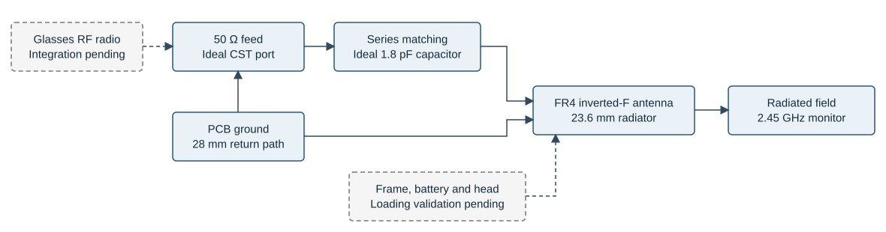
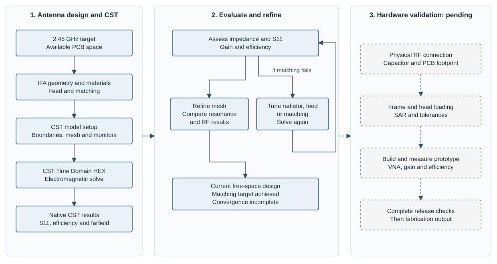

# Antenna functional architecture

The project centers on a 2.45 GHz inverted-F antenna for a smart-glasses temple. The present CST model evaluates the antenna, local PCB ground, ideal matching capacitor and local housing in free space.

## RF path

| Block | Function | Current status |
|---|---|---|
| Radio interface | Supplies the RF signal for the intended glasses system. | Integration pending; no complete transceiver is modeled. |
| 50 Ω feed | Excites the antenna at its local feed point. | Ideal discrete CST port. |
| 1.8 pF matching capacitor | Compensates inductive reactance to improve input matching. | Ideal series element; physical component and parasitics pending. |
| FR4 IFA radiator | Converts accepted RF power into a radiated electromagnetic field. | 23.6 mm radiator on the 50 × 6 mm PCB. |
| PCB ground | Provides the return-current path and affects input impedance and radiation. | 28 mm ground length. |
| Frame, battery and head | Affect loading, coupling, detuning and exposure during wear. | Complete integration and head-loaded studies pending. |

Solid blue blocks show the current model. Gray dashed blocks show planned integration. The diagram does not imply a completed radio or a validated wearable assembly.

## Design and simulation process

The design process starts with the frequency target and available PCB space. Geometry, materials, feed, matching and boundaries define the CST model. The time-domain solve provides S11, efficiency and farfield results. Radiator length, feed/short position and matching are adjusted and simulated again when the target response is not achieved.

Actual mesh refinements are compared before accepting convergence. The latest model provides the reported matching result, but the last resonance shift is above the convergence threshold. Physical-feed, component, frame/head, SAR, tolerance and prototype checks remain pending before fabrication.

## Main design relationships

- Radiator length controls the electrical length and influences resonance.
- Feed and short positions influence input resistance and reactance.
- The matching capacitor offsets inductive input reactance at the target frequency.
- Ground geometry influences the return-current path, impedance and radiation.
- Nearby structures and the head may shift resonance and change efficiency and gain; their effect needs a completed CST study.

The effects depend on the complete geometry and loading. Each proposed modification requires a new simulation rather than an assumed numerical improvement. Refer to [simulation results](simulation-evidence.md) for definitions and numerical limits and to [hardware validation](hardware-validation.md) for the remaining work.
